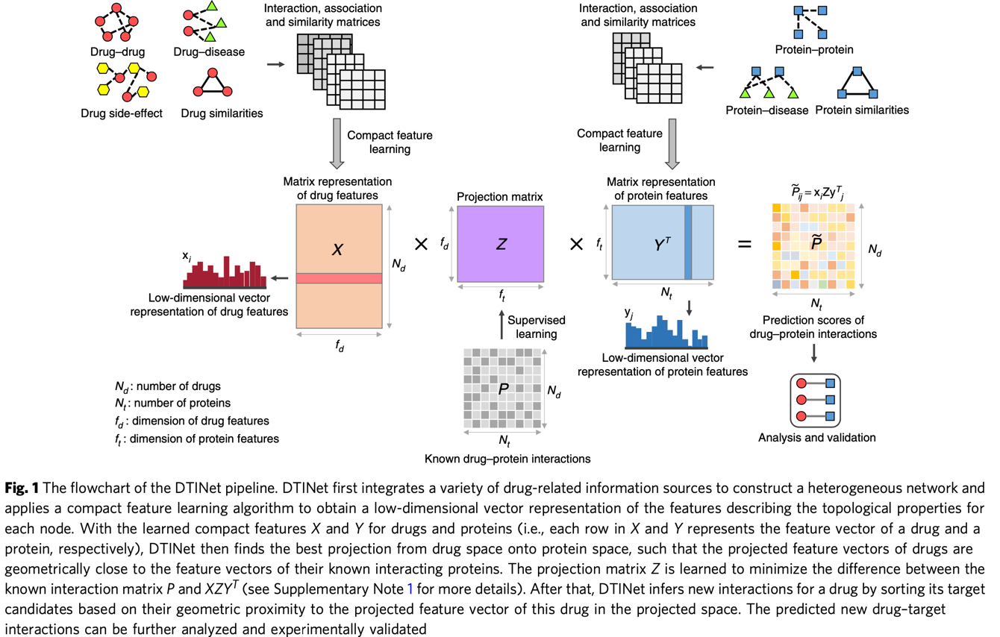

# Summmaries of ML papers on chemical reaction predictions

## Databases:
   ### 1. [DrugBank](https://go.drugbank.com/)
   ### 2. [PubChem](https://pubchem.ncbi.nlm.nih.gov/)
   ### 3. [Binding DB](https://www.bindingdb.org/bind/chemsearch/marvin/SDFdownload.jsp?all_download=yes)
   ### 4. [STITCH](http://stitch.embl.de/cgi/download.pl?UserId=dews03Qv1XJT&sessionId=NhrchAJbMTpN)
   ### 5. [DGIdb](https://dgidb.genome.wustl.edu/)
   ### 6. [ChEMBL](https://www.ebi.ac.uk/chembl/)
   ### 7. [pharmgkb](https://www.pharmgkb.org/)
   ### 8. [KEGG](https://www.genome.jp/kegg/)
   

1. ### [A multiple kernel learning algorithm for drug-target interaction prediction](https://bmcbioinformatics.biomedcentral.com/articles/10.1186/s12859-016-0890-3)
   _Nascimento et al. BMC Bioinformatics (2016) 17:46 DOI 10.1186/s12859-016-0890-3_

   __i. Summary__:
        
      * Propose KronRLS-MKL that models drug-target interactions as a link prediction of bipartite graph
      * This method allows integration of multiple heterogeneous information sources and also works with arbitrary sized networks.
      * Automatically returns more relevant kernels for drug-target prediction

   __ii. Method__:
    
   
   __iii. Results__:

   __iv. Comments__:
   * Thesourcecodeanddatasetsareavailableat www.cin.ufpe.br/~acan/kronrlsmkl/
   
2. ### [A network integration approach for drug-target interaction prediction and computational drug repositioning from heterogeneous information](https://www.nature.com/articles/s41467-017-00680-8)
    _Yunan Luo et.al Nature communications 2017_

   __i. Summary__:
      * Propose DTINet which learns a low-dimentional vector representation of features and then makes\
      makes drug-target interaction predictions based on these representations via a vector space projection shceme.
      * T
      *  
  
   __ii. Method__:
   
   * The heterogeneous network integrates four types of nodes (i.e., drugs, proteins, diseases and side-effects) and six types of edges (i.e., drug–protein interactions, drug–drug interactions, drug–disease associations, drug–side-effect associations, protein–disease associations and protein–protein interactions
      

   __iii. Results__:
      * Experimentally validate the novel interactions between three drugs and the cyclooxygenase proteins predicted by DTINet, and demonstrate the new potential applications of these identified cyclooxygenase inhibitors in preventing inflammatory diseases
 
   __iv. Comments__:
   * Data and Code: https://github.com/luoyunan/DTINet

3. ### [MolTrans: Molecular Interaction Transformer for drug–target interaction prediction](https://academic.oup.com/bioinformatics/article/37/6/830/5929692?login=true)
   _Huang et.al, Bioinformatics, 37(6), 2021, 830–836_

   __i. Summary__:
   * Given the input drug and protein data, a FCS mining module first decom- poses them into a set of explicit sequences of sub-structures using a specialized decomposition algorithm. 
   * The outputs are then fed into a augmented transformer embedding module to obtain an aug- mented contextual embedding for each sub-structure through trans- former encoders. 
   * Next, in the interaction prediction module, drug sub-structures are paired with protein sub- structures with pairwise interaction scores. 
   * A CNN layer is later applied on the interaction map to capture higher-order interactions. Finally, a decoder module outputs a score indicating the probability of pairwise interactions

   __ii. Method__:

      

   __iii. Results__:
   * E

   __iv. Comments__:

4. ### [On the Frustration to Predict Binding Affinities from Protein−Ligand Structures with Deep Neural Networks](https://pubs.acs.org/doi/10.1021/acs.jmedchem.2c00487)
   _Volkov J. Med. Chem. 2022 (accepted)_

   __i. Summary__:
   * Ligands, protiens, and protien-ligand complexes are represented as graphs
   __ii. Method__:
   * Used a graph CNN (MPNNs) as undirected graph

   __iii. Results__:
   * 

   __iv. Comments__:

