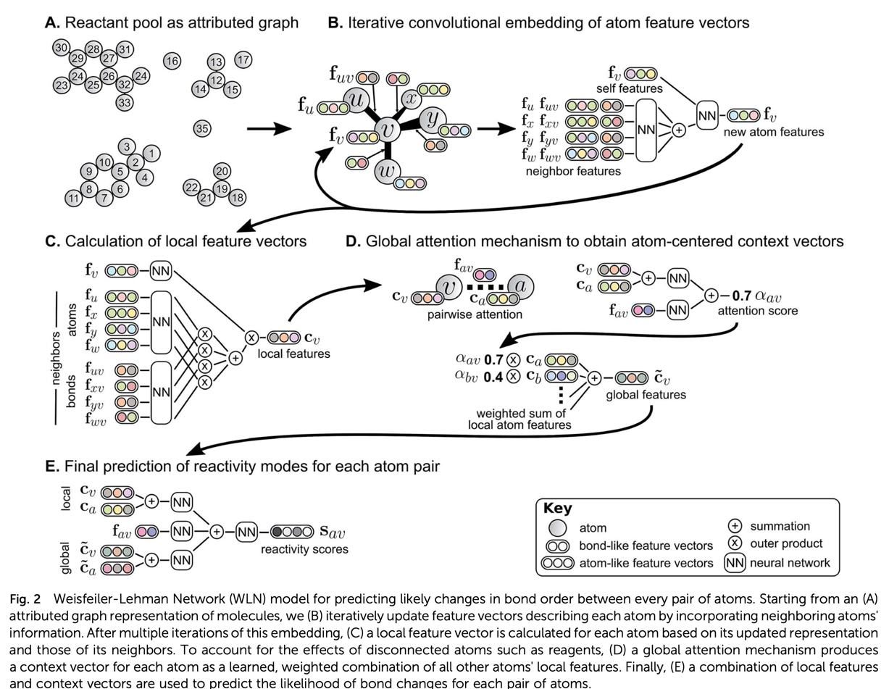
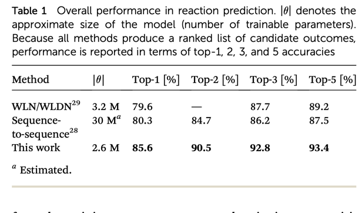

# Summmaries of ML papers on chemical reaction predictions

1. ### [A Structure-Based Platform for Predicting Chemical Reactivity](https://www.cell.com/chem/pdfExtended/S2451-9294(20)30085-1)

   __i. Summary__:
        
      * Developed a versatile machine learning model, which takes in multiple fingerprint features (MFFs) as inputs and make predictions for molecular              properties,         yields, stereoselectivities, and relative conversion.
      * QM9 data set is used for HOMO-LUMO gap prediction (RF model)
  
   __ii. Contributions__:

   __iii. Method__:
    
   For each molecule an array of 24 different fingerprints were generated using RDKit. Concatenated MFFs are used to train RF or NN model. Got better results with RF model since it is less prone to overfitting. 
  
   __iv. Results__:

   __v. Comments__:
   * Data and code available at: https://zivgitlab.uni-muenster.de/m_kueh11/fp-dm-tool
   

    
2. ### [A graph-convolutional neural network model for the prediction of chemical reactivity](https://pubs.rsc.org/en/content/articlepdf/2019/sc/c8sc04228d)
    
   __i. Summary__:
      * Presents a ML model to predict product when reactants, solvent and reagents are given.
      * Two stages: 1) identifies reactive sites 2) enumeration of products
  
   __ii. Contributions__:
  
   __iii. Method__:
      * Weisfeiler-Lehman Network, a graph convolutional neural net is used
      * 
  

   __iv. Results__:
   * 
  
   __v. Comments__:

1. ### Title: 
    
     __i. Summary__:
  
    __ii. Contributions__:
  
    __iii. Method__:
  
    __iv. Results__:
  
    __v. Comments__:
